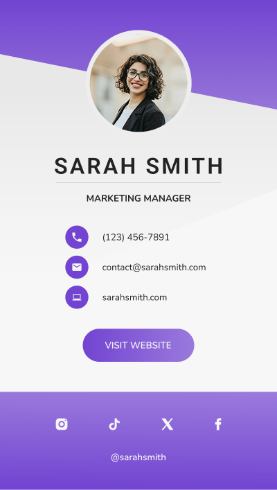

# 💼 Digital Business Card

A digital business card built with React, showcasing personal contact details, a profile image, and social media links.

Creating my first React component taught me the fundamentals of building reusable UI elements using JSX and JavaScript. I learned how to define functional components, pass data through props, and use class names for styling with CSS. It also helped me understand the structure of a React app, how components are rendered in the DOM, and how to break down a user interface into small, manageable pieces. Overall, it was a great introduction to thinking in components and organising code for maintainability and scalability.



---

## 🛠 Tech Stack

- **React** – Frontend JavaScript library for building UI components  
- **HTML5** – Semantic markup  
- **CSS3** – Custom styling and layout  
- **SVG** – Custom background triangle design  
- **Vite / Create React App** *(optional)* – For building and serving the project

---

## ✨ Key Features

- Clean, modern UI with custom background styling  
- Responsive layout for desktop-sized viewports  
- Reusable components (e.g., `Header`, `Button`, `ContactDetails`)  
- Social media icons and handle display  
- Modular structure for maintainability

---

## ⚙️ Build Process

1. Created a new React project using `create-react-app` or `vite`
2. Broke down the business card into smaller reusable components  
3. Styled the UI using custom CSS  
4. Used SVG for a custom triangle background  
5. Imported and rendered image assets as React props  
6. Rendered the app into a root DOM node via `ReactDOM.createRoot`

---

## 📚 Lessons Learnt

- How to create and export functional React components  
- How to use props to pass data into components  
- The difference between `class` and `className` in JSX  
- Structuring React projects into logical, reusable modules  
- Applying styles using external CSS and understanding React’s rendering lifecycle

---

## 🧩 Areas for Improvement

- Add responsive design for mobile screens  
- Link social media icons to actual URLs  
- Make the "Visit Website" button functional  
- Use PropTypes or TypeScript for better type checking  
- Add unit tests for component behavior
- Add more accessibility features

---

## 🛠 Setup Instructions

1. **Clone the repository:**

   ```bash
   git clone https://github.com/your-username/react-business-card.git
   cd react-business-card

2. **Install dependencies:**

   ```bash
   git clone https://github.com/your-username/react-business-card.git
   cd react-business-card

3. **Start the development server:**

   npm start

4. **Build for production:**

   npm run build